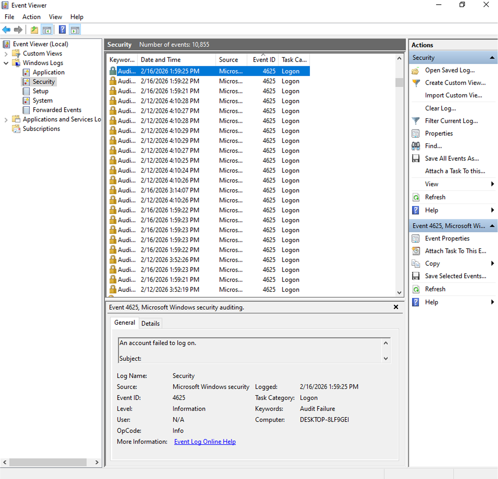
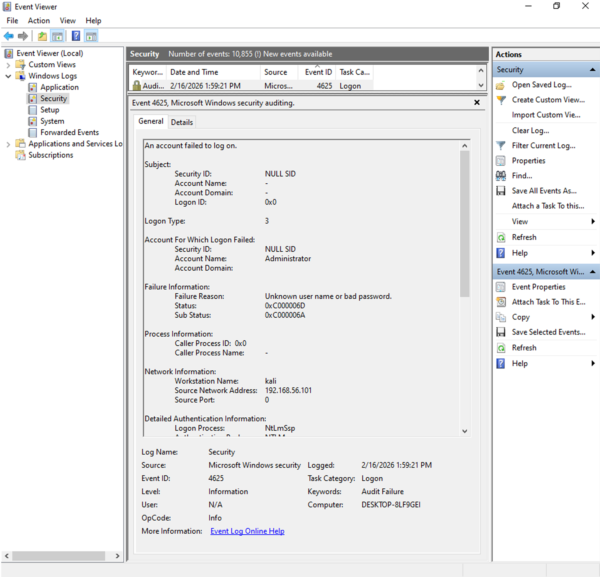

# Wazuh SIEM Lab: Brute Force Detection and Investigation
## Objective

This project simulates a real-world brute force attack against a Windows system and demonstrates how it can be detected and investigated using Wazuh SIEM.

The lab replicates a Security Operations Center (SOC) workflow including attack simulation, log collection, alert generation, and incident investigation.

Brute force attacks are commonly used by adversaries to gain unauthorized access through repeated authentication attempts, making early detection critical for security operations.

MITRE ATT&CK Technique:

T1110 – Brute Force

This technique is commonly used by attackers to gain unauthorized access through repeated authentication attempts.

https://attack.mitre.org/techniques/T1110/
## Lab Architecture

The lab environment consisted of three virtual machines:

| Machine        | Role                              | IP Address       | OS            |
|---------------|-----------------------------------|------------------|--------------|
| Wazuh Server  | SIEM                              | 192.168.56.102   | Ubuntu Server |
| Windows Target| Victim Machine (Wazuh Agent)      | 192.168.56.103   | Windows 10    |
| Kali Linux    | Attacker Machine                  | 192.168.56.101   | Kali Linux    |
## Network Architecture Diagram
               [ Kali Linux ]
        Attacker - 192.168.56.101
                    |
                    | Attack traffic
                    v
             [ Windows Target ]
         Victim - 192.168.56.103
             (Wazuh Agent)
                    |
                    | Log forwarding
                    v
             [ Wazuh Server ]
          SIEM - 192.168.56.102
           (Detection & Alerts)
## Attack flow:

Kali Linux → Windows Target → Wazuh SIEM detection
## Log Flow

Windows Target → Wazuh Agent → Wazuh Server → Alert generated
## Tools Used

- Wazuh SIEM (Security Information and Event Management)
  
- Kali Linux (attacker machine)
  
- Hydra (brute force attack tool)
  
- Windows Event Viewer (log analysis)
  
- VirtualBox (lab virtualization environment)

## Attack Simulation
A brute-force attack was completed using _Hydra_ from the Kali Linux system and the Windows Remote Desktop Protocol (RDP) service was the target.


Command used:

```bash
> **_hydra -l Administrator -P rockyou.txt rdp://192.168.56.103_**
```

This command will generate multiple variations of passwords against the Administrator account with the _Rockyou.txt_ word list.


This example illustrates a _real-world brute-force attack_, as is typically seen in corporate environments.
## Detection in Wazuh SIEM

The Wazuh Agent installed on the Windows machine collected logs and forwarded them to the Wazuh Server.

Wazuh analyzed the logs using its detection rules and generated alerts based on suspicious activity.

**Alert characteristics observed:**

- Multiple failed login attempts in short time period

- Same source IP address

- Same target account

- Security Event Log correlation

- High severity alert level

**Example Wazuh alert details:**

Rule ID: **_18107_**  
Rule Level: **_10_**  
Rule Description: **_Multiple Windows login failures detected_**  
MITRE Technique: **_T1110 – Brute Force_** 

This rule is triggered when multiple failed login attempts are detected within a short timeframe, indicating potential brute force activity.

**Source IP identified in alert:**

> 192.168.56.101 (Kali Linux attacker machine)

**Target account:**

> Administrator

This confirms the attack originated from the attacker machine and targeted the Windows system.

**Relevant Windows Event ID:**

Event ID **4625** — Failed login attempt
## Detection workflow

1 - Attack executed from Kali Linux

2 - Event generated on Windows machine

3 - Wazuh Agent collected event log

4 - Log forwarded to Wazuh Server

5 - Wazuh analyzed log

6 - Alert generated in SIEM dashboard
## Evidence

### Wazuh Alert Showing Failed Login Attempts


These alerts show multiple failed login attempts detected by Wazuh from the attacker machine.

---

### Windows Event Viewer Showing Event ID 4625




These logs confirm authentication failures generated during the brute force attack.

## Investigation Process

The investigation followed standard SOC analyst workflow:

Step 1 - Alert Identification
Wazuh SIEM generated alerts indicating multiple failed login attempts.

Step 2 - Log Analysis
Analysis of Windows Security Logs confirmed Event ID **_4625_**.

Step 3 - Source Identification
Source IP address was identified as:

**_192.168.56.101 (Kali Linux attacker machine)_**

Step 4 - Pattern Confirmation
Multiple login failures within a short timeframe confirmed brute force activity.

Step 5 - Threat Classification
Attack mapped to MITRE ATT&CK technique:

**_T1110 – Brute Force_**
## Timeline of Events

The following timeline was observed during the attack simulation:

- 13:59:21 — First failed login attempt detected (Event ID 4625)

- 13:59:22 — Multiple failed login attempts recorded from source IP 192.168.56.101

- 13:59:23 — Wazuh SIEM generated alert for multiple authentication failures

- 13:59:24 — Investigation confirmed brute force pattern targeting Administrator account

This timeline demonstrates how SIEM enables rapid detection and investigation of malicious activity.
## Security Impact

If this were a real environment, this attack could result in:

- Unauthorized access

- Privilege escalation

- Lateral movement

- Data exfiltration

- Full system compromise

Early detection by SIEM is critical to prevent escalation.
## Recommended Mitigation

The following mitigation actions are recommended to prevent or reduce brute force attacks:

- Block the attacker IP address at the firewall
- Enable account lockout policy after multiple failed login attempts
- Enable Multi-Factor Authentication (MFA)
- Restrict RDP access to trusted IP addresses only
- Monitor authentication logs continuously using SIEM

These measures significantly reduce the risk of unauthorized access.
## Skills Demonstrated

This project demonstrates practical SOC analyst skills including:

- SIEM monitoring and alert analysis

- Brute force attack detection

- Windows Event Log analysis

- Security incident investigation

- Threat detection using Wazuh

- MITRE ATT&CK framework mapping

- Log correlation and threat identification
  
- Security event correlation
  
- Threat detection and analysis

## Conclusion

This lab successfully simulated and detected a brute force attack using Wazuh SIEM.

The SIEM correctly identified multiple failed authentication attempts, generated high-severity alerts, and provided sufficient log data to investigate and confirm malicious activity.

This project demonstrates practical SOC analyst skills including threat detection, log analysis, incident investigation, and SIEM monitoring in a realistic environment.

These capabilities are essential for detecting and responding to real-world cyber threats.

## Author

**Moises da Mata**  
Junior SOC Analyst | Cybersecurity Enthusiast  

LinkedIn: https://www.linkedin.com/in/moisesdamata/  
GitHub: https://github.com/MoisesDaMata  

This project is part of my cybersecurity portfolio demonstrating hands-on SIEM monitoring, threat detection, and incident investigation skills aligned with real-world SOC operations.


